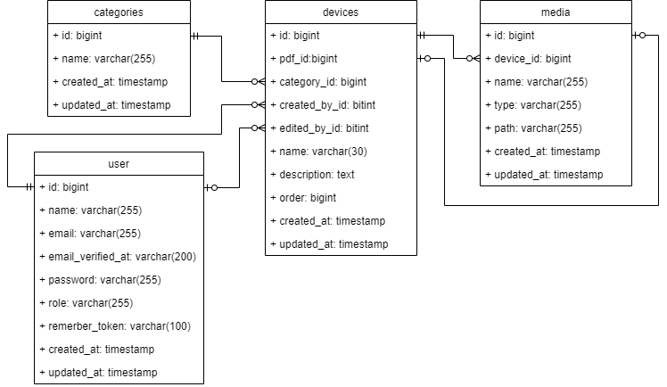

# Device

Floris van Engen - 26-07-2022

## Database diagram



## De applicatie lokaal kunnen laten draaien

### Benodigde software

Om de applicatie lokaal te kunnen draaien moet de volgende software geïnstalleerd zijn:

- [Composer](https://getcomposer.org/download/)
- Een browser ([Chrome](https://www.google.com/intl/nl_nl/chrome/), [Firefox](https://www.mozilla.org/nl/firefox/new/),
  etc.)
- [Git-gui](https://git-scm.com/download/win)
- [XAMPP](https://www.apachefriends.org/)

### Eerste keer lokaal draaien

Als de applicatie nog niet lokaal op de computer staat kan de volgende stappen uitgevoerd worden:

1. Open Git Bash en clone de [applicatie](https://github.com/FlorisvanEngen/device) in de map "C:\xampp\htdocs".
2. Ga naar de map van de applicatie door de commando "cd device" uit te voeren.

```text
cd device
```

3. Voer de commando "composer install" uit.

```text
composer install
```

4. Voer de commando "npm install" uit.

```text
npm install
```

5. Maak een kopie van de .env.example file met de naam .env door de volgende commando uit te voeren.

```text
cp .env.example .env
```

6. Configureer de db instellingen en de App_key. Dit kan via de volgende commando. (Als er geen bestaande App_key
   beschikbaar is kan deze worden aangemaakt in stap 9)

```text
nano .env
```

7. Open XAMPP en start de module's apache en mysql.
8. Ga naar [phpMyAdmin](http://localhost/phpmyadmin/index.php) en maak een database aan met de naam dat in stap 6 is
   geconfigureerd. [^1]
9. Als de App_key in stap 6 is ingesteld kan deze stap worden overgeslagen. Voer de commando "php artisan key:generate"
   uit om een nieuwe App_key aan te maken. [^2]

```text
php artisan key:generate
```

10. Voer de commando "php artisan migrate:fresh --seed" uit. Hiermee word de database tabellen aangemaakt en voorzien
    van dummy data.

```text
php artisan migrate:fresh --seed
```

11. Voer de commando "npm run dev" uit. Hiermee worden de benodigde scss en js bestanden gecompileerd en gekopieerd naar
    de public map.

```text
npm run prod
```

12. Start de applicatie op door de commando "php artisan serve" uit te voeren. De url van de applicatie staat in de
    Git Bash terminal. [^3]

```text
php artisan serve
```

Nu is de applicatie gestart om lokaal te kunnen gebruiken.

### Bestaande applicatie lokaal draaien

Als de applicatie al op de computer staat en heeft al een keer gedraaid, dan kan de volgende stappen uitgevoerd worden:

1. Open XAMPP en start de module mysql.
2. Open Git Bash en ga naar de hoofdmap van de applicatie.
3. Start de applicatie op door de commando "php artisan serve" uit te voeren. De url van de applicatie staat in de
   Git Bash terminal. [^3]

```text
php artisan serve
```

[^1]: PhpMyAdmin is geïnstalleerd via XAMPP.

[^2]: De App_key sleutel mag alleen aangemaakt worden bij nieuwe applicaties of bij applicaties dat niet met andere
databases samenwerkt. Deze sleutel word namelijk gebruikt om de database gegevens te kunnen ver- en ontsleutelen.

[^3]: Om de applicatie te kunnen gebruiken mag de Git Bash terminal niet gesloten worden. De commando "php artisan
serve" moet ook uitgevoerd blijven worden. 
